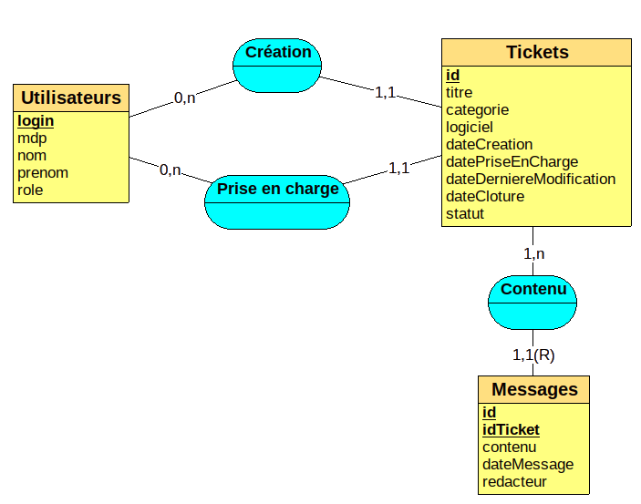

# EasyTicket

Cette application a été réalisé durant le semestre cinq de ma formation à l'université Faculté des Sciences et Technologies de Vandoeuvre-lès-Nancy (54500 France)

## Description

Cette application permet de gérer des tickets de clients pour pouvoir faciliter le suivi et la maintenance des différents logiciels installés chez ses eux.

Un ticket posté par un client n’a pas de destinataire spécifique. Il contient un message, qui peut être un retour
d’incident constaté sur un logiciel spécifique, une requête concernant les fonctionnalités d’un logiciel, ou
encore un message plus général, ne concernant pas forcément un logiciel spécifique. Lors de l’envoi, le client
précise la catégorie de son message et si besoin, le logiciel et le système concernés.

Les tickets sont traités par ordre chronologique, par une équipe d’ingénieurs et de techniciens. Un ingénieur
peut traiter toute sorte de ticket. Un technicien est apte à traiter seulement les tickets de une ou plusieurs
catégories données.

Le traitement d’un ticket peut revêtir différentes formes : le ticket est changé de catégorie (en cas d‘erreur par
exemple) ; le ticket donne lieu à un ou plusieurs échanges avec le client ; le ticket est clos (problème résolu ou
insoluble). Si la personne qui doit traiter le ticket ne sait pas le gérer, il peut attribuer son ticket à une autre personne ingénieur/technicien, apte à le faire.

L’application conserve trace des échanges :

Un client peut consulter l’historique de tous les tickets déposés (identification, date, message, etc.),
connaître le nom de la personne qui a pris en charge le ticket, la date à laquelle cette prise en charge a
commencé, etc.

Vous pouvez accéder aux documents de [Spécification](Specification.pdf) et de [Conception](Conception.pdf) pour plus de détails.

## Dépendances

- OS : Ubuntu 20.04 
- Qt 5.12
- qtcreator v. 4.11
- qmake v. 3.1

## Modèle de la base de données

## Auteurs
[LESNIAK Louis](https://github.com/LESNIAK-Louis)
 
HASSANE CHEKOU KORE Aboubacar
 
JOFFROY Theo